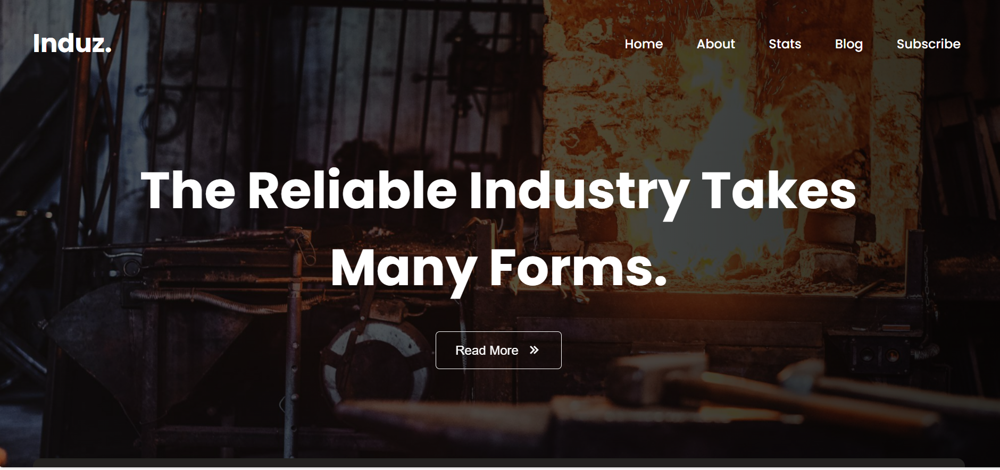

# 🏭 Induz – Industrial Business Website  



**Induz** is a modern and professional **industrial business website** designed for manufacturing, construction, and engineering companies.  
The website highlights company history, statistics, services, blogs, and customer testimonials with a clean layout and smooth animations.  
Built using **HTML**, **CSS**, and **JavaScript**, this project focuses on **corporate design**, **responsiveness**, and **user engagement**.

---

## ✨ Features  

- 🏠 **Home Section** — Strong hero section with call-to-action button  
- ℹ️ **About Us Section** — Company history and core values  
- 📊 **Stats Section** — Company achievements and milestones  
- 📰 **Blog Section** — Latest industry news and insights  
- ⭐ **Testimonials Slider** — Customer reviews using Swiper.js  
- 📩 **Newsletter Subscription** — Email signup form  
- 📱 **Responsive Design** — Optimized for all screen sizes  

---

## 🖼 Demo  

👉 **Live Demo:** [Click Here](https://fsafiya187.github.io/Induz/)

---

## 🛠️ Tech Stack  

- **HTML5** — semantic and structured markup  
- **CSS3** — custom layouts, animations, and responsive design  
- **JavaScript (ES6)** — interactivity and navigation  
- **Swiper.js** — testimonial slider  
- **Remix Icon** — modern icon library  
- **ScrollReveal.js** — smooth scroll animations  

---

## ⚙️ How to Use  

1. **Clone the repository**
   ```bash
   git clone https://github.com/fsafiya187/Induz.git

2. **Navigate to the project folder**
cd Induz


3. **Open the project**
Open index.html in your browser

---

## 📚 Learning Highlights


Creating a professional industrial website layout


Implementing responsive multi-section designs


Integrating Swiper.js for sliders


Using ScrollReveal for UI animations


Designing structured content for corporate websites

---

## 🧾 License
This project is open-source and available under the MIT License.

---

## 💬 Author
Safiya Fathima
🌐 GitHub: fsafiya187

